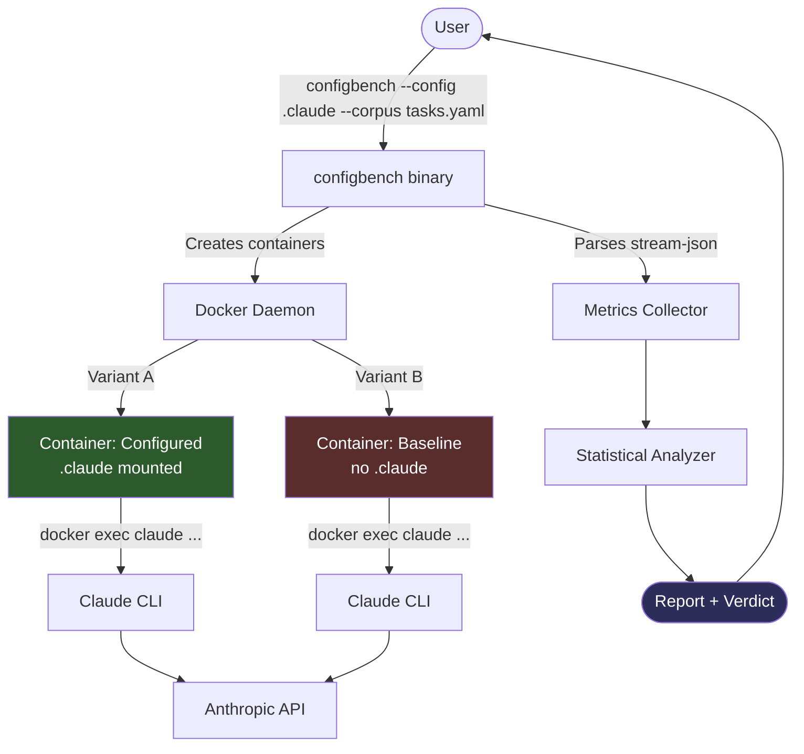
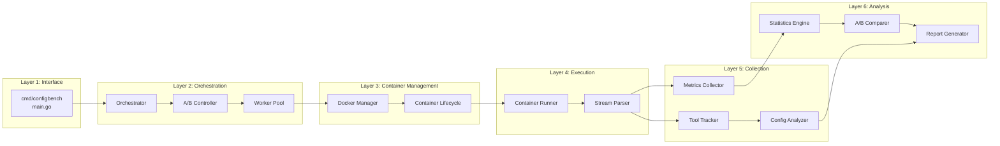
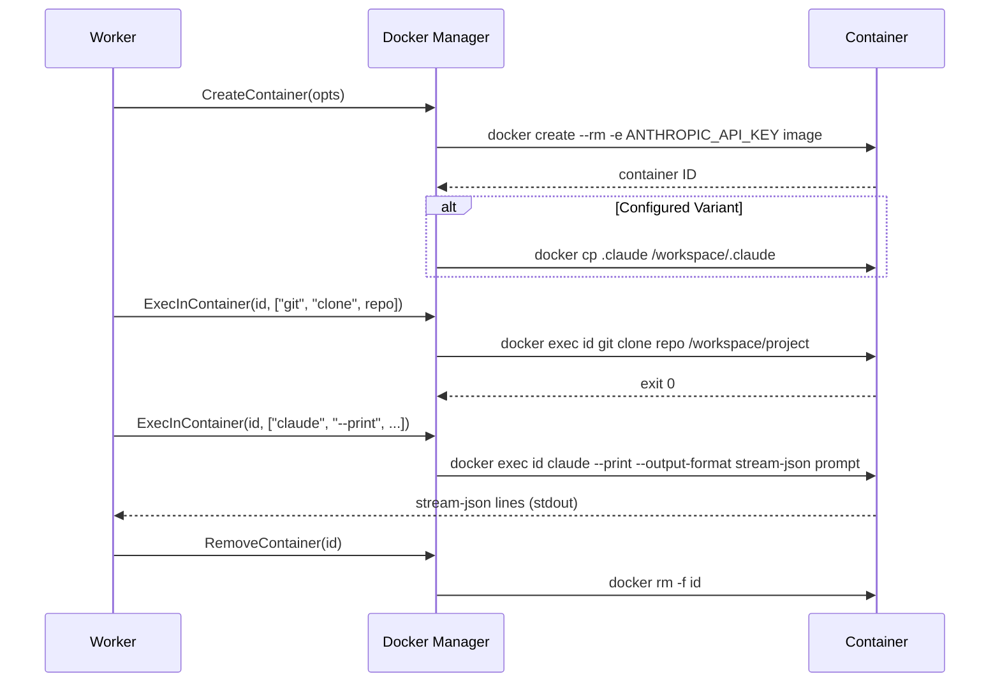
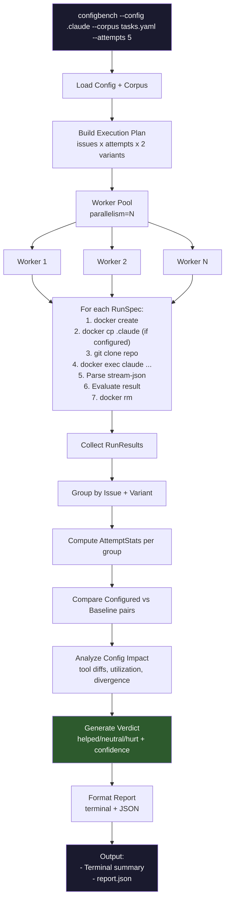
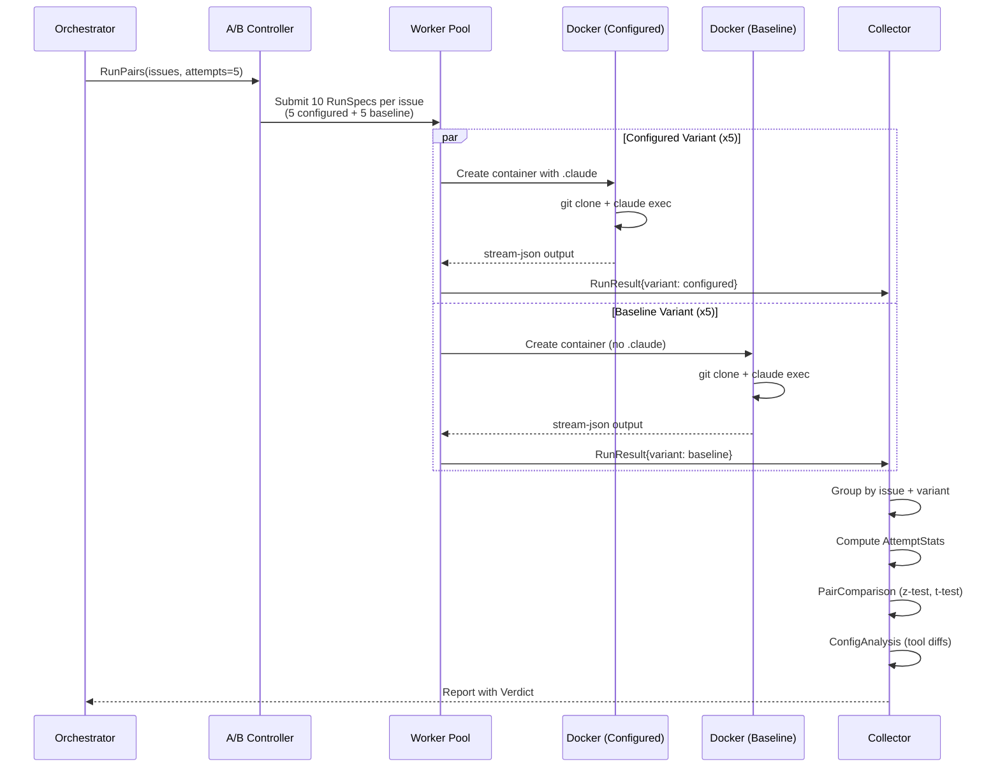

# configbench: Claude Code Configuration Benchmarking Tool

> Architecture POC — Does your `.claude` configuration actually help?

## Executive Summary

`configbench` is a single-binary tool that measures whether a user's `.claude` configuration (CLAUDE.md, MCP servers, skills, hooks, settings) improves Claude Code's effectiveness on real-world coding tasks.

It runs **A/B comparisons** inside Docker containers: the same problem set is attempted N times with the user's config (configured variant) and N times without it (baseline variant). Stream-json output is parsed to track every tool call, skill invocation, and agent delegation. Statistical analysis produces a verdict: **helped**, **neutral**, or **hurt**, with confidence level and actionable recommendations.

**Key properties:**
- Single binary, minimal external dependencies (`gopkg.in/yaml.v3` for YAML parsing, `golang.org/x/sync` for errgroup)
- Docker isolation prevents test runs from affecting the host
- Reuses `claudesdk-go` types (`StreamMessage`, `ContentBlock`, `SessionMetrics`) for stream parsing
- A/B protocol with configurable attempts for statistical rigor

---

## Current State: What We Already Have

The `claudesdk-go` SDK provides the foundation this tool builds on:

| Component | Location | What It Gives Us |
|-----------|----------|------------------|
| `StreamMessage` | `message.go:38` | Type-safe representation of every stream-json line |
| `ContentBlock` | `message.go:123` | Tool use, text, and thinking block parsing |
| `SessionMetrics` | `options.go:453` | Cost, tokens, turns, duration — all the metrics we need |
| `ExtractInitTools()` | `extract.go:307` | Available tool list from init message — for comparing config vs baseline |
| `GetAllToolCalls()` | `extract.go:197` | Every tool invocation in a message — for tracking tool patterns |
| `Hooks` | `options.go:380` | `OnToolCall`, `OnMetrics`, `OnMessage` — real-time observation |
| `LaunchOptions` | `options.go:74` | 30+ CLI flags including `MCPServers`, `Agents`, `AllowedTools` |

**What's missing (what this tool adds):**
- Docker container orchestration
- Repeated-attempt execution with worker pool
- A/B comparison protocol
- Tool call classification (built-in vs MCP vs skill vs agent)
- Statistical analysis (z-test, t-test, confidence intervals)
- Configuration impact analysis and verdict generation

---

## Architecture Overview

### System Context



### Layered Architecture



---

## Component Design

### 1. CLI (`cmd/configbench/main.go`)

Entry point. Parses flags, loads config, runs orchestrator, prints report.

```
configbench \
  --config .claude \
  --corpus tasks.yaml \
  --attempts 5 \
  --parallelism 4 \
  --image ghcr.io/mateosegura/dev-env:latest \
  --output report.json \
  --timeout 10m \
  --verbose
```

| Flag | Default | Description |
|------|---------|-------------|
| `--config` | `.claude` | Path to `.claude` configuration directory |
| `--corpus` | required | Path to task corpus YAML |
| `--attempts` | `5` | Number of attempts per variant per task |
| `--parallelism` | `2` | Max concurrent containers |
| `--baseline` | `true` | Run baseline (no config) variant |
| `--image` | `ghcr.io/mateosegura/dev-env:latest` | Docker image |
| `--output` | stdout | Report output path |
| `--timeout` | `10m` | Per-task timeout |
| `--filter-difficulty` | all | Filter corpus by difficulty |
| `--filter-language` | all | Filter corpus by language |
| `--filter-task` | all | Filter corpus by task type |
| `--dry-run` | `false` | Show execution plan without running |
| `--verbose` | `false` | Verbose output |

### 2. Orchestrator (`internal/orchestrator/orchestrator.go`)

Builds the execution plan and coordinates the full benchmark run.

```go
type BenchConfig struct {
    ConfigDir    string        // Path to .claude directory
    CorpusPath   string        // Path to corpus YAML
    Attempts     int           // Runs per variant per issue
    Parallelism  int           // Max concurrent containers
    RunBaseline  bool          // Whether to run baseline variant
    Image        string        // Docker image name
    Timeout      time.Duration // Per-task timeout
    MaxTurns     int           // Max agentic turns per run
    OutputPath   string        // Report output path
    Filters      CorpusFilter  // Difficulty/language/task filters
}

// Run executes the full benchmark and returns raw results.
// The CLI layer (Phase 5) calls analysis.BuildReport() on these results.
func (o *Orchestrator) Run(ctx context.Context) ([]*metrics.RunResult, error)
```

**Execution plan generation:** For each issue in the corpus, generate `attempts * 2` work items (N configured + N baseline). The plan is deterministic given the same config and corpus.

### 3. A/B Controller (`internal/orchestrator/abcontroller.go`)

Pairs configured and baseline runs for the same issue.

```go
type Variant string

const (
    Configured Variant = "configured"
    Baseline   Variant = "baseline"
)

type RunSpec struct {
    Issue     corpus.Issue
    Variant   Variant
    Attempt   int
    ConfigDir string // Empty for baseline
    Image     string
    Timeout   time.Duration
    MaxTurns  int
}

type RunPair struct {
    Issue      corpus.Issue
    Configured []RunSpec // N attempts with config
    Baseline   []RunSpec // N attempts without config
}
```

### 4. Worker Pool (`internal/orchestrator/pool.go`)

Bounded concurrency via `errgroup.SetLimit(parallelism)`. Each worker creates a container, runs a task, collects results, and tears down the container.

```go
func (p *Pool) Execute(ctx context.Context, specs []RunSpec, progress func(RunSpec, *metrics.RunResult)) ([]*metrics.RunResult, error)
```

### 5. Docker Manager (`internal/docker/manager.go`)

Container lifecycle via `os/exec` — no Docker Go client, zero dependencies. This matches the SDK's own subprocess pattern for running the Claude CLI.

```go
type Manager struct {
    Image string
}

func (m *Manager) CreateContainer(ctx context.Context, opts ContainerOpts) (containerID string, err error)
func (m *Manager) ExecInContainer(ctx context.Context, id string, cmd []string) (stdout, stderr io.Reader, exitCode int, err error)
func (m *Manager) RemoveContainer(ctx context.Context, id string) error
```

**Container setup sequence:**



**Key design decision:** The `configbench` binary orchestrates **from outside** the container. Claude runs **inside** via `docker exec`. This keeps the binary simple and stateless — it never needs to be inside the container itself.

**Container options:**

```go
type ContainerOpts struct {
    Image     string
    ConfigDir string            // Mounted read-only at /workspace/.claude (empty for baseline)
    Env       map[string]string // ANTHROPIC_API_KEY, etc.
    WorkDir   string            // Default: /workspace
}
```

### 6. Container Runner (`internal/docker/runner.go`)

Executes `docker exec <id> claude --print --output-format stream-json --verbose <prompt>` and parses stdout line-by-line using the SDK's `StreamMessage` type.

```go
func (r *Runner) Run(ctx context.Context, cfg RunConfig) (*metrics.RunResult, error)
```

**Stream parsing reuses SDK types directly:**

```go
// Inside the runner's read loop:
scanner := bufio.NewScanner(stdout)
for scanner.Scan() {
    var msg claude.StreamMessage
    if err := json.Unmarshal(scanner.Bytes(), &msg); err != nil {
        continue // Skip unparseable lines (stderr leakage, etc.)
    }

    // Track init tools (what's available)
    if tools := claude.ExtractInitTools(&msg); tools != nil {
        result.InitTools = tools
    }

    // Track every tool call
    for _, tc := range claude.GetAllToolCalls(&msg) {
        tracker.Record(tc.Name, tc.Input)
    }

    // Capture final metrics
    if claude.IsResult(&msg) {
        result.CostUSD = msg.CostUSD
        result.DurationMS = msg.DurationMS
        result.NumTurns = msg.NumTurns
        result.Usage = msg.Usage
    }
}
```

This is the same parsing pattern the SDK uses internally in `Launcher.ReadMessage()` (`launcher.go:378`), but applied to `docker exec` stdout instead of a direct subprocess.

### 7. Metrics Collector (`internal/metrics/collector.go`)

Aggregates per-run data into a structured result.

```go
type RunResult struct {
    // Identity
    IssueID   string
    Variant   string // "configured" or "baseline"
    Attempt   int

    // Outcome
    Success   bool
    Score     float64 // 0.0-1.0, from evaluation
    ErrorMsg  string

    // SDK Metrics (from result message)
    CostUSD     float64
    DurationMS  int64
    NumTurns    int
    Usage       *claude.Usage

    // Configuration Metrics (from init + tool tracking)
    InitTools       []string           // Tools available at session start
    ToolCalls       []ToolCall         // Every tool invocation, in order
    ToolCallSummary map[string]int     // tool name -> call count

    // Output
    FinalText   string // Final text from result message

    // Issue metadata (set by orchestrator, used by analysis for breakdowns)
    Difficulty  string
    Language    string
    TaskType    string
}

type ToolCall struct {
    Timestamp time.Time
    Name      string
    Input     map[string]any
    Category  ToolCategory
}

type ToolCategory string

const (
    BuiltIn ToolCategory = "built_in" // Read, Write, Edit, Bash, Glob, Grep, ...
    MCP     ToolCategory = "mcp"      // mcp__serverName__toolName
    Skill   ToolCategory = "skill"    // Skill tool invocations
    Agent   ToolCategory = "agent"    // Task tool invocations (subagents)
)
```

### 8. Tool Tracker (`internal/metrics/tracker.go`)

Classifies each tool call by category. The classification is derived from Claude CLI's naming conventions:

```go
func classifyTool(name string) ToolCategory {
    switch {
    case strings.HasPrefix(name, "mcp__"):
        return MCP       // MCP server tools use mcp__ prefix
    case name == "Skill":
        return Skill     // Skill tool invokes slash commands
    case name == "Task":
        return Agent     // Task tool spawns subagents
    default:
        return BuiltIn   // Read, Write, Edit, Bash, Glob, Grep, etc.
    }
}
```

**Why this matters:** A `.claude` config's value often shows up in *which categories of tools* are used. A config with MCP servers should increase `mcp` calls. A config with custom skills should show `skill` calls. If neither appears in the configured variant, the config isn't being utilized.

### 9. Config Analyzer (`internal/analysis/config.go`)

Compares tool availability and usage patterns between configured and baseline variants.

```go
type ConfigAnalysis struct {
    // Tool availability diff (from init messages)
    ConfigAddedTools   []string // Tools present in configured but not baseline
    ConfigRemovedTools []string // Tools present in baseline but not configured

    // Tool usage diff (from actual calls)
    ToolUsageDiff map[string]UsageDelta // tool name -> {configured_count, baseline_count}

    // Behavioral signals
    SkillInvocations int     // How many times Skill tool was called (configured only)
    AgentInvocations int     // How many times Task tool was called
    MCPToolCalls     int     // How many MCP tool calls occurred

    // Derived metrics
    ConfigUtilization  float64 // intersection(added_tools, tools_actually_used) / added_tools
    BehaviorDivergence float64 // Jaccard distance between tool-call sets
}
```

**`ConfigUtilization`** answers: "Of the tools the config added, how many did Claude actually use?" A value of 0.0 means the config added tools that were never called — a strong signal the config isn't helping.

**`BehaviorDivergence`** answers: "How different was Claude's tool usage with vs without config?" Measured as Jaccard distance between the two tool-call sets. High divergence means the config changed behavior; whether that's good depends on the success/score metrics.

### 10. Statistics Engine (`internal/analysis/stats.go`)

Aggregates across attempts and computes statistical significance.

```go
type AttemptStats struct {
    N          int     // Number of attempts
    SuccessRate float64 // Proportion of successful attempts
    ScoreMean   float64
    ScoreStdDev float64
    ScoreCI95   [2]float64 // 95% confidence interval

    CostMean    float64
    CostStdDev  float64
    TurnsMean   float64
    DurationMean float64

    TokensMean struct {
        Input  float64
        Output float64
    }
}

type PairComparison struct {
    IssueID string

    Configured AttemptStats
    Baseline   AttemptStats

    // Deltas (configured - baseline)
    SuccessRateDelta float64
    ScoreDelta       float64
    CostDelta        float64
    TurnsDelta       float64

    // Statistical significance
    SuccessRatePValue float64 // Two-proportion z-test
    ScorePValue       float64 // Paired t-test (when N >= 3)
    Significant       bool    // p < significance_threshold
}
```

**Statistical approach:**
- **Success rate:** Two-proportion z-test. With N=5 attempts, detects a 40pp difference at p<0.05.
- **Score:** Paired t-test when N >= 3. Compares mean scores across attempts.
- **Cost/turns/duration:** Descriptive statistics only (mean, stddev). These are secondary metrics.

### 11. Report Generator (`internal/analysis/report.go`)

Produces the final report with verdict.

```go
type Report struct {
    // Metadata
    Timestamp   time.Time
    CorpusSize  int
    TotalRuns   int

    // Aggregate results
    Configured  AttemptStats
    Baseline    AttemptStats

    // Per-issue breakdown
    Comparisons []PairComparison

    // Configuration analysis
    ConfigAnalysis ConfigAnalysis

    // Verdict
    Verdict Verdict

    // Breakdowns
    ByDifficulty map[string]PairComparison
    ByTaskType   map[string]PairComparison
    ByLanguage   map[string]PairComparison
}

type Verdict struct {
    Helped         bool    // Did the config improve outcomes?
    Confidence     string  // "high", "medium", "low"
    SuccessRateGain float64
    ScoreGain       float64
    CostImpact      float64 // Positive = more expensive
    Summary         string  // Human-readable summary
    Recommendations []string
}
```

**Verdict logic:**

```
Helped = SuccessRateGain > 0 AND ScoreGain >= 0

Confidence:
  high   = sigRatio > 0.7 AND attempts >= 5
  medium = sigRatio > 0.4 AND attempts >= 3
  low    = otherwise

  where sigRatio = (significant comparisons) / (total comparisons)
```

**Recommendations** are generated from the analysis:
- Low `ConfigUtilization` (< 0.3): "Config adds tools that Claude never uses. Consider removing unused MCP servers."
- High `CostImpact` (> 1.5x): "Config increases cost significantly. Review whether additional tools justify the expense."
- Low `BehaviorDivergence` (< 0.1): "Config doesn't change Claude's behavior. The configuration may be redundant."

---

## Data Flow



---

## A/B Comparison Flow



---

## Configuration Schema

### Benchmark Config (`benchmark.yaml`)

```yaml
# What to test
config:
  path: .claude              # Path to .claude directory to benchmark
  description: "My project config with MCP servers and custom skills"

# Docker settings
docker:
  image: ghcr.io/mateosegura/dev-env:latest

# Execution parameters
execution:
  attempts: 5                # Runs per variant per task
  parallelism: 2             # Max concurrent containers
  timeout: 10m               # Per-task timeout
  baseline: true             # Run baseline variant
  max_turns: 25              # Max agentic turns per run

# Task corpus
corpus:
  path: corpus/tasks.yaml    # Path to task definitions
  filters:
    difficulty: [easy, medium]
    language: [go, typescript]
    task_type: [bug_fix, feature]

# Analysis parameters
analysis:
  significance_threshold: 0.05  # p-value threshold
  improvement_threshold: 0.1    # Minimum meaningful improvement

# Output
output:
  path: report.json
  formats: [terminal, json]     # Output formats
```

### Corpus Schema (`corpus/tasks.yaml`)

```yaml
corpus:
  name: "Claude Code Effectiveness"
  version: "1.0"

issues:
  - id: go-nil-check
    title: "Fix nil pointer dereference in handler"
    description: "The /api/users endpoint panics when..."
    repo: https://github.com/example/project
    ref: main
    difficulty: easy
    language: go
    task_type: bug_fix
    prompt: "Fix the nil pointer dereference in the users handler"
    max_turns: 15
    setup_commands:
      - "cd /workspace/project && go mod download"
    evaluation:
      method: command         # command | file_contains | test_passes | llm_judge
      command: "cd /workspace/project && go vet ./..."
      expected_exit_code: 0
    expected_tools:           # Optional: tools we expect a good config to use
      - Read
      - Edit
      - Bash

  - id: ts-auth-feature
    title: "Add JWT refresh token rotation"
    description: "Implement refresh token rotation..."
    repo: https://github.com/example/webapp
    ref: feat/auth
    difficulty: hard
    language: typescript
    task_type: feature
    prompt: "Implement JWT refresh token rotation with..."
    evaluation:
      method: test_passes
      command: "cd /workspace/project && npm test -- --grep 'refresh'"
```

**Evaluation methods:**

| Method | How It Works |
|--------|-------------|
| `command` | Run a command, check exit code matches `expected_exit_code` |
| `file_contains` | Check if a file contains expected content |
| `test_passes` | Run test suite, check all pass |
| `llm_judge` | Use a separate Claude call to evaluate the result (expensive) |

---

## Metrics Collection Strategy

### What We Collect Per Run

| Metric | Source | How |
|--------|--------|-----|
| Available tools | Init message `Tools` field | `claude.ExtractInitTools()` |
| Permission mode | Init message `PermissionMode` field | `claude.ExtractInitPermissionMode()` |
| Every tool call | Assistant messages with `tool_use` blocks | `claude.GetAllToolCalls()` |
| Tool call category | Tool name pattern matching | `classifyTool()` |
| Final cost | Result message `CostUSD` | `claude.IsResult()` check |
| Token usage | Result message `Usage` | Direct field access |
| Turn count | Result message `NumTurns` | Direct field access |
| Duration | Result message `DurationMS` | Direct field access |
| Success/score | Post-run evaluation command | Container exec |

### Init Tools Comparison

The init message's `Tools` field reveals what Claude *could* use. Comparing configured vs baseline init tools shows what the `.claude` config adds:

```
Baseline init tools:    [Read, Write, Edit, Bash, Glob, Grep, Task, ...]
Configured init tools:  [Read, Write, Edit, Bash, Glob, Grep, Task, Skill,
                         mcp__context7__resolve, mcp__github__create_pr, ...]
                                                    ↑
                                    Config added these MCP tools
```

### Tool Call Pattern Analysis

Beyond what's *available*, we track what's *actually used*:

```
Baseline calls:    Bash(12), Read(8), Edit(5), Grep(3)
Configured calls:  Bash(6), Read(10), Edit(5), Grep(2),
                   mcp__context7__resolve(3), Skill(2), Task(1)
                                                  ↑
                              Config changed behavior: fewer Bash, more MCP
```

---

## Report Format

### Terminal Output

```
configbench v0.1.0 — Configuration Benchmark Report
════════════════════════════════════════════════════

Verdict: HELPED (high confidence)
  "Configuration improved success rate by 20% with no significant cost increase.
   MCP tools were actively utilized (3 of 4 added tools used)."

Summary
┌────────────┬────────────┬──────────┬────────┐
│ Metric     │ Configured │ Baseline │ Delta  │
├────────────┼────────────┼──────────┼────────┤
│ Success    │ 80%        │ 60%      │ +20%*  │
│ Score      │ 0.85       │ 0.72     │ +0.13* │
│ Cost       │ $0.42      │ $0.38    │ +$0.04 │
│ Turns      │ 8.2        │ 9.4      │ -1.2   │
│ Duration   │ 45s        │ 52s      │ -7s    │
└────────────┴────────────┴──────────┴────────┘
* statistically significant (p < 0.05)

By Difficulty
  easy:   +30% success, +0.15 score
  medium: +15% success, +0.10 score
  hard:   +10% success, +0.12 score

Configuration Impact
  Added tools:  mcp__context7__resolve, mcp__github__create_pr,
                mcp__github__get_issue, mcp__playwright__navigate
  Utilization:  75% (3 of 4 added tools were used)
  Skills used:  2 invocations (commit, review-pr)
  Agents used:  1 invocation (code-reviewer)
  Behavior divergence: 0.34 (moderate — config changed tool patterns)

Top Improvements
  go-nil-check:     100% vs 60% success (+40%)
  ts-auth-feature:   80% vs 40% success (+40%)

Bottom Improvements
  py-refactor:       60% vs 60% success (0%)
```

### JSON Output

Full `Report` struct serialized as JSON for programmatic consumption.

---

## Directory Structure

The project uses `claudesdk-go` as a Git submodule (separate Go module). Benchmarking logic, CLIs, and documentation live at the `.claude-test` root level. `configtest/` is also a separate Go module for importability.

```
.claude-test/
├── .claude/                           # Git submodule: config being tested
│
├── claudesdk-go/                      # Git submodule: Go SDK (separate module)
│   ├── claude.go                      # CLI availability, version
│   ├── session.go                     # High-level async API
│   ├── launcher.go                    # Low-level subprocess control
│   ├── message.go                     # StreamMessage, ContentBlock (reused)
│   ├── extract.go                     # Extraction helpers (reused)
│   ├── options.go                     # LaunchOptions, Hooks (reused)
│   ├── errors.go                      # Error types
│   ├── examples/                      # Usage examples
│   └── go.mod                         # module github.com/MateoSegura/claudesdk-go
│
├── configtest/                        # Config validation (separate module)
│   ├── doc.go                         # Package documentation
│   ├── discover.go                    # Auto-discovery + assertion helpers
│   ├── structural_test.go             # Frontmatter, naming, settings
│   ├── dryrun_test.go                 # Exercises assertions without CLI
│   ├── live_test.go                   # Real Claude CLI (build tag: live)
│   └── go.mod                         # module github.com/MateoSegura/.claude-test/configtest
│
├── cmd/
│   ├── configbench/
│   │   ├── main.go                    # Docker A/B benchmark CLI entry point
│   │   └── progress.go                # Thread-safe progress reporter
│   ├── runtest/
│   │   └── main.go                    # Extension test CLI entry point
│   └── bench/
│       └── main.go                    # Legacy direct benchmark CLI
│
├── internal/
│   ├── corpus/
│   │   ├── corpus.go                  # Corpus, Issue types
│   │   └── loader.go                  # YAML loading + validation
│   │
│   ├── docker/
│   │   ├── executor.go                # Executor interface
│   │   ├── executor_docker.go         # Docker implementation
│   │   ├── executor_mock.go           # Mock for testing
│   │   ├── manager.go                 # Container create/exec/remove via os/exec
│   │   └── runner.go                  # Claude execution + stream-json parsing
│   │
│   ├── orchestrator/
│   │   ├── orchestrator.go            # Top-level benchmark coordinator
│   │   ├── abcontroller.go            # A/B variant pairing
│   │   ├── pool.go                    # Bounded worker pool
│   │   └── config.go                  # BenchConfig type + YAML loading
│   │
│   ├── metrics/
│   │   ├── collector.go               # RunResult type + aggregation
│   │   ├── tracker.go                 # Tool call tracking + classification
│   │   └── parser.go                  # Stream-json to metrics extraction
│   │
│   ├── analysis/
│   │   ├── stats.go                   # AttemptStats, statistical tests
│   │   ├── compare.go                 # PairComparison, A/B delta computation
│   │   ├── config.go                  # ConfigAnalysis, utilization, divergence
│   │   ├── report.go                  # Report + Verdict types
│   │   ├── verdict.go                 # Verdict generation logic
│   │   ├── format_terminal.go         # Terminal table output
│   │   └── format_json.go            # JSON serialization
│   │
│   ├── benchmark/                     # Legacy benchmark framework
│   │   ├── corpus.go
│   │   ├── evaluator.go
│   │   ├── results.go
│   │   └── runner.go
│   │
│   └── tests/                         # Extension test framework
│       ├── runner.go
│       └── validators.go
│
├── corpus/
│   └── sample.yaml                    # Sample benchmark corpus
│
├── docs/
│   ├── arch/
│   │   ├── poc.md                     # This document
│   │   └── poc/                       # Phase implementation details
│   └── diagrams/                      # Auto-generated architecture diagrams
│
├── go.mod                             # Root module: github.com/MateoSegura/.claude-test
└── go.sum
```

---

## Implementation Sequence

### Phase 1: Foundation
- `internal/corpus/` — Corpus and Issue types, YAML loader
- `internal/docker/manager.go` — Container lifecycle via `os/exec`
- `internal/metrics/collector.go` — RunResult type
- `internal/metrics/tracker.go` — Tool call classification

### Phase 2: Container Execution
- `internal/docker/runner.go` — Claude execution inside containers
- Stream-json parsing using `claude.StreamMessage`
- Evaluation execution (command, test_passes, etc.)

### Phase 3: Orchestration
- `internal/orchestrator/config.go` — BenchConfig YAML loading
- `internal/orchestrator/abcontroller.go` — Variant pairing
- `internal/orchestrator/pool.go` — Worker pool with `errgroup`
- `internal/orchestrator/orchestrator.go` — Full run coordination

### Phase 4: Analysis
- `internal/analysis/stats.go` — Aggregation, z-test, t-test
- `internal/analysis/compare.go` — Pair comparison
- `internal/analysis/config.go` — Config impact analysis
- `internal/analysis/verdict.go` — Verdict generation
- `internal/analysis/report.go` — Report assembly
- `internal/analysis/format_*.go` — Output formatting

### Phase 5: CLI
- `cmd/configbench/main.go` — Flag parsing, orchestrator wiring
- Progress reporting during execution

---

## Key Design Decisions

| Decision | Rationale |
|----------|-----------|
| Binary outside, Claude inside | Keeps the binary stateless. No need to install configbench inside containers. Orchestration logic stays on the host. |
| `os/exec` for Docker (no Go client) | Minimal dependencies. Matches the SDK's own subprocess pattern for running Claude CLI. `docker create`, `docker exec`, `docker rm` are stable, well-documented commands. |
| Reuse SDK `StreamMessage` types | The stream-json format is identical whether it comes from a subprocess or `docker exec` stdout. No need to re-define message types. |
| Tool classification by naming convention | Claude CLI uses `mcp__` prefix for MCP tools, `Skill` for skill invocations, `Task` for agent spawning. These are stable conventions. |
| Multiple attempts with statistical tests | A single run is noisy. N=5 attempts with z-tests and t-tests gives statistical grounding to the verdict. |
| Jaccard distance for behavior divergence | Simple, interpretable metric for "how different are the tool-call sets." 0 = identical behavior, 1 = completely different. |
| YAML for configuration | Human-readable, supports comments, standard for CLI tools. Requires `gopkg.in/yaml.v3` dependency. |
| `golang.org/x/sync/errgroup` for pool | Standard Go extended library for bounded concurrency with error propagation. |

---

## Operational Considerations

### Cost Management

Each run invokes Claude CLI, which costs API tokens. A benchmark with 10 issues, 5 attempts, 2 variants = 100 Claude sessions.

**Estimated cost per benchmark run:**
- Easy tasks (~$0.02/session): 100 sessions = ~$2
- Hard tasks (~$0.10/session): 100 sessions = ~$10
- Mixed corpus: ~$6 typical

Mitigations:
- `--attempts 3` for quick checks (reduces cost 40%)
- `--filter-difficulty easy` to test only easy tasks first
- `--max-budget` flag on individual Claude runs (via `LaunchOptions.MaxBudgetUSD`)
- `--dry-run` to preview execution plan before committing

### Container Startup Latency

Each container takes 2-5 seconds to create and initialize. With `--parallelism 4`, the pool amortizes this across concurrent workers. The `ghcr.io/mateosegura/dev-env:latest` image should be pre-pulled to avoid download latency on first run.

### Authentication

The `ANTHROPIC_API_KEY` environment variable is passed into containers via `docker create -e`. It is never written to disk inside the container. The key must be set in the host environment before running `configbench`.

### MCP Server Startup

MCP servers defined in the `.claude` config need their dependencies available inside the container. The `dev-env` image should include `npx`, `node`, and common MCP server packages. If a server fails to start, Claude will log an error in the stream-json output and continue without it — this is expected behavior for the baseline variant.
