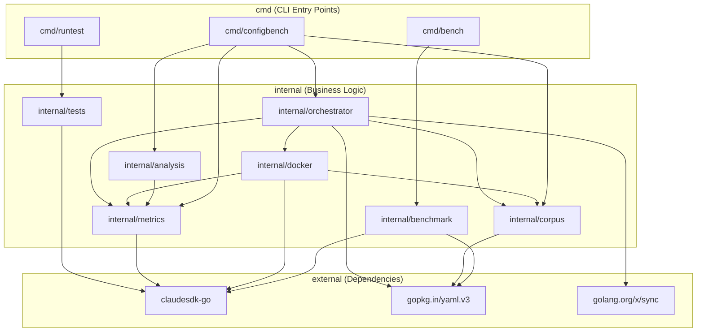

<!-- Generated by /docs-diagrams-code -->
<!-- Source: . -->
<!-- Date: 2026-01-28 -->

# Architecture Diagram

A benchmark and testing framework for evaluating Claude Code `.claude` configurations. The system provides three CLI entry points: `bench` for direct benchmarking against GitHub repositories, `configbench` for Docker-containerized A/B comparison benchmarks with statistical analysis, and `runtest` for extension test validation. Internal packages handle corpus loading, Docker container management, metrics collection/parsing, orchestrated parallel execution, statistical analysis with reporting, and extension test validation. The external `claudesdk-go` SDK is used for Claude CLI interaction across benchmark evaluation, metrics streaming, and test execution.

## Components

| Name | Description |
|------|-------------|
| `claudesdk-go` | External Go SDK for interacting with the Claude CLI, providing session management, streaming, and result collection |
| `cmd/bench` | CLI entry point for running benchmark tests against `.claude` configurations using direct repository cloning |
| `cmd/configbench` | CLI entry point for Docker-containerized A/B benchmarking with statistical analysis and formatted reporting |
| `cmd/runtest` | CLI entry point for executing extension tests (skills, commands) against Claude CLI with graded scoring |
| `golang.org/x/sync` | External concurrency primitive library, used by the orchestrator pool for `errgroup` |
| `gopkg.in/yaml.v3` | External YAML parsing library used for loading corpus and configuration files |
| `internal/analysis` | Statistical analysis and reporting: compares configured vs baseline runs, computes stats (mean, stddev, CI95, z-test, t-test), generates verdicts, and formats output as terminal or JSON |
| `internal/benchmark` | Legacy benchmark runner: corpus loading (YAML), issue evaluation (test suite, LLM judge, custom check, hybrid), result aggregation, and Claude SDK invocation for direct benchmarking |
| `internal/corpus` | Corpus data model and loader: defines Issue, Evaluation, and CorpusFilter types; loads and validates YAML corpus files; applies filters by difficulty, language, and task type |
| `internal/docker` | Docker container management: Executor interface with Docker and Mock implementations, Manager for container lifecycle (create, copy, exec, remove), and Runner for executing benchmark runs inside containers |
| `internal/metrics` | Metrics collection: RunResult and ToolCall data types, Tracker for recording and classifying tool calls, StreamParser for extracting metrics from Claude stream-json output |
| `internal/orchestrator` | Benchmark orchestration: BenchConfig YAML loading/validation, A/B plan generation (RunSpec/RunPair), concurrent Pool execution with errgroup, and Orchestrator coordinating Docker manager and task runner |
| `internal/tests` | Extension test framework: TestRunner for executing Claude CLI with loaded extensions, validators (text, regex, code, LLM judge), Suite/TestCase/TestResult types with graded scoring |

## Source Files Analyzed

- cmd/bench/main.go
- cmd/configbench/main.go
- cmd/configbench/progress.go
- cmd/runtest/main.go
- internal/analysis/compare.go
- internal/analysis/config.go
- internal/analysis/format_json.go
- internal/analysis/format_terminal.go
- internal/analysis/report.go
- internal/analysis/stats.go
- internal/analysis/verdict.go
- internal/benchmark/corpus.go
- internal/benchmark/evaluator.go
- internal/benchmark/results.go
- internal/benchmark/runner.go
- internal/corpus/corpus.go
- internal/corpus/loader.go
- internal/docker/executor.go
- internal/docker/executor_docker.go
- internal/docker/executor_mock.go
- internal/docker/manager.go
- internal/docker/runner.go
- internal/metrics/collector.go
- internal/metrics/parser.go
- internal/metrics/tracker.go
- internal/orchestrator/abcontroller.go
- internal/orchestrator/config.go
- internal/orchestrator/orchestrator.go
- internal/orchestrator/pool.go
- internal/tests/runner.go
- internal/tests/validators.go
