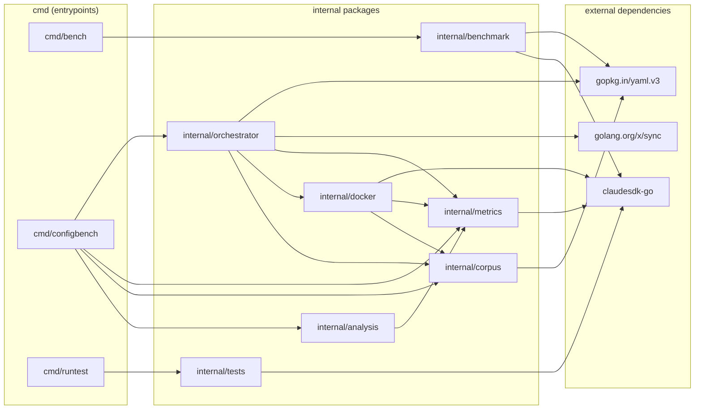

<!-- Generated by /docs-diagrams-code -->
<!-- Source: . -->
<!-- Date: 2026-01-28 -->

# Dependency Graph

Dependency graph for `github.com/MateoSegura/.claude-test` showing internal package relationships, command entrypoints, and external dependencies. Edges represent actual `import` statements found in non-test `.go` source files.

## Components

| Name | Description |
|------|-------------|
| `claudesdk-go` | Go SDK for the Claude CLI providing session management, streaming, and result collection |
| `cmd/bench` | CLI entrypoint for running benchmark tests against `.claude` configurations using real GitHub repos |
| `cmd/configbench` | CLI entrypoint for A/B benchmarking configurations in Docker containers with statistical analysis |
| `cmd/runtest` | CLI entrypoint for executing extension tests (skills, commands) against the Claude CLI |
| `golang.org/x/sync` | Concurrency primitives; used by the orchestrator worker pool via `errgroup` |
| `gopkg.in/yaml.v3` | YAML parser; used for loading corpus definitions and benchmark configuration files |
| `internal/analysis` | Statistical analysis and reporting: computes stats, compares configured vs baseline runs, generates verdicts, and formats output (terminal/JSON) |
| `internal/benchmark` | Benchmark framework: defines corpus/issue types, runs Claude against repos, evaluates solutions via test suites, LLM judges, and custom checks |
| `internal/corpus` | Corpus data model and loader: defines Issue/Evaluation types, loads and validates YAML corpus files, and applies difficulty/language/task filters |
| `internal/docker` | Docker container lifecycle management and command execution: creates/removes containers, copies configs, and executes Claude CLI inside containers |
| `internal/metrics` | Metrics collection and stream parsing: defines RunResult/ToolCall types, parses Claude stream-JSON output, and tracks tool usage with auto-classification |
| `internal/orchestrator` | Benchmark orchestration: manages configuration, generates A/B execution plans, runs specs concurrently via a worker pool, and coordinates container-based execution |
| `internal/tests` | Extension test framework: defines test cases/suites with validators, runs Claude CLI with extensions loaded, and supports LLM-based validation |

## Source Files Analyzed

- `cmd/bench/main.go`
- `cmd/configbench/main.go`
- `cmd/configbench/progress.go`
- `cmd/runtest/main.go`
- `internal/analysis/compare.go`
- `internal/analysis/config.go`
- `internal/analysis/format_json.go`
- `internal/analysis/format_terminal.go`
- `internal/analysis/report.go`
- `internal/analysis/stats.go`
- `internal/analysis/verdict.go`
- `internal/benchmark/corpus.go`
- `internal/benchmark/evaluator.go`
- `internal/benchmark/results.go`
- `internal/benchmark/runner.go`
- `internal/corpus/corpus.go`
- `internal/corpus/loader.go`
- `internal/docker/executor.go`
- `internal/docker/executor_docker.go`
- `internal/docker/manager.go`
- `internal/docker/runner.go`
- `internal/metrics/collector.go`
- `internal/metrics/parser.go`
- `internal/metrics/tracker.go`
- `internal/orchestrator/abcontroller.go`
- `internal/orchestrator/config.go`
- `internal/orchestrator/orchestrator.go`
- `internal/orchestrator/pool.go`
- `internal/tests/runner.go`
- `internal/tests/validators.go`
