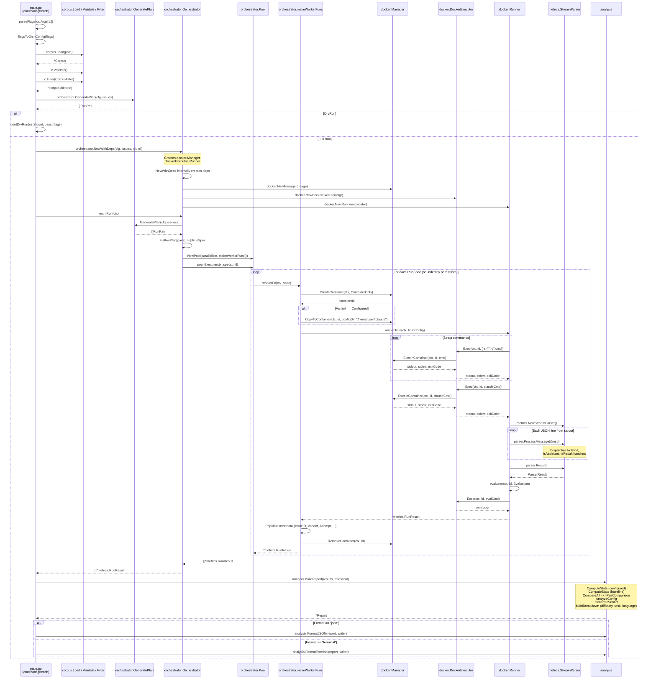

<!-- Generated by /docs-diagrams-code -->
<!-- Source: . -->
<!-- Date: 2026-01-28 -->

# Execution Flow

The `configbench` CLI benchmarks Claude configurations by running benchmark tasks inside Docker containers, comparing "configured" (with custom `.claude` config) and "baseline" (no config) variants across multiple attempts. It loads a YAML corpus of issues, generates an execution plan of `RunSpec` entries, dispatches them through a bounded worker pool, collects metrics by parsing Claude's stream-json output, evaluates success via post-run commands, and produces a statistical comparison report.

## Components

| Name | Description |
|------|-------------|
| `main()` / `run()` | CLI entry point; parses flags, orchestrates the full pipeline from corpus load to report output |
| `parseFlags()` | Parses command-line arguments into a `cliFlags` struct with validation |
| `flagsToOrchConfig()` | Converts CLI flags into an `orchestrator.BenchConfig` |
| `printDryRun()` | Prints the execution plan without running any benchmarks |
| `corpus.Load()` | Reads and unmarshals a YAML corpus file into a `Corpus` struct |
| `Corpus.Validate()` | Validates all issues have required fields and valid evaluation methods |
| `Corpus.Filter()` | Filters issues by difficulty, language, and task type (AND across fields, OR within) |
| `orchestrator.GeneratePlan()` | Creates `RunPair` entries for each issue with configured and optional baseline variants |
| `orchestrator.FlattenPlan()` | Converts `[]RunPair` into a flat `[]RunSpec` in deterministic order |
| `orchestrator.NewWithDeps()` | Constructs an `Orchestrator` with injected or default Docker dependencies |
| `orchestrator.Orchestrator.Run()` | Generates plan, flattens specs, and executes them through the worker pool |
| `orchestrator.Pool` | Manages concurrent execution with `errgroup` and a configurable parallelism limit |
| `Pool.Execute()` | Dispatches all `RunSpec` entries through bounded goroutines, returns ordered results |
| `orchestrator.makeWorkerFunc()` | Returns a closure that creates a container, copies config, runs the task, and cleans up |
| `docker.Manager` | Manages Docker container lifecycle via `os/exec` (`create`, `cp`, `exec`, `rm`) |
| `docker.DockerExecutor` | Implements `Executor` interface by delegating to `Manager.ExecInContainer()` |
| `docker.Runner` | Executes a full benchmark run: setup commands, Claude invocation, stream parsing, evaluation |
| `Runner.Run()` | Orchestrates setup, Claude CLI execution, JSON stream parsing, and post-run evaluation |
| `Runner.evaluate()` | Runs post-run evaluation (`command`, `test_passes`, or `file_contains` methods) |
| `metrics.StreamParser` | Processes Claude stream-json messages and extracts cost, duration, turns, usage, and tool calls |
| `StreamParser.ProcessMessage()` | Routes messages through `IsInit`, `IsAssistant`, and `IsResult` handlers |
| `metrics.Tracker` | Records and classifies tool calls (BuiltIn, MCP, Skill, Agent) during a run |
| `metrics.RunResult` | Captures the full outcome of a single benchmark run including metrics and metadata |
| `analysis.BuildReport()` | Constructs a full `Report` from results: stats, comparisons, config analysis, verdict, breakdowns |
| `analysis.ComputeStats()` | Calculates aggregate statistics (success rate, score, cost, turns, duration, tokens) |
| `analysis.CompareAll()` | Groups results by issue and variant, produces `PairComparison` for each issue |
| `analysis.ComparePair()` | Computes deltas and statistical significance (z-test, paired t-test) between variants |
| `analysis.AnalyzeConfig()` | Compares tool availability and usage between configured and baseline runs |
| `analysis.GenerateVerdict()` | Produces a final verdict (helped/hurt/neutral) with confidence level and recommendations |
| `analysis.FormatTerminal()` | Renders the report as a human-readable table with deltas and significance markers |
| `analysis.FormatJSON()` | Serializes the report as indented JSON |
| `ProgressReporter` | Prints real-time progress lines as benchmark runs complete (concurrent-safe) |

## Source Files Analyzed

- `cmd/configbench/main.go` -- CLI entry point, flag parsing, top-level orchestration
- `cmd/configbench/progress.go` -- Real-time progress reporting during benchmark execution
- `internal/corpus/corpus.go` -- Corpus, Issue, Evaluation, and CorpusFilter type definitions
- `internal/corpus/loader.go` -- YAML loading, validation, and filtering of the issue corpus
- `internal/orchestrator/config.go` -- BenchConfig and sub-spec types, YAML loading, defaults, validation
- `internal/orchestrator/abcontroller.go` -- RunSpec, RunPair, GeneratePlan, FlattenPlan
- `internal/orchestrator/orchestrator.go` -- Orchestrator struct, New, NewWithDeps, Run, makeWorkerFunc
- `internal/orchestrator/pool.go` -- Pool with errgroup-based bounded concurrency
- `internal/docker/manager.go` -- Docker container lifecycle management via os/exec
- `internal/docker/executor.go` -- Executor interface definition
- `internal/docker/executor_docker.go` -- DockerExecutor implementation wrapping Manager
- `internal/docker/runner.go` -- Runner: setup, Claude CLI execution, stream parsing, evaluation
- `internal/metrics/collector.go` -- RunResult, ToolCall, ToolCategory type definitions
- `internal/metrics/parser.go` -- StreamParser for processing Claude stream-json messages
- `internal/metrics/tracker.go` -- Tracker for recording and classifying tool calls
- `internal/analysis/report.go` -- BuildReport, top-level Report struct, breakdown builder
- `internal/analysis/stats.go` -- Statistical functions (Mean, StdDev, CI95, z-test, t-test), ComputeStats
- `internal/analysis/compare.go` -- PairComparison, ComparePair, CompareAll
- `internal/analysis/config.go` -- ConfigAnalysis, AnalyzeConfig, JaccardDistance, tool diff utilities
- `internal/analysis/verdict.go` -- Verdict generation with confidence levels and recommendations
- `internal/analysis/format_terminal.go` -- Terminal report formatter with delta formatting
- `internal/analysis/format_json.go` -- JSON report formatter
