<!-- Generated by /docs-diagrams-code -->
<!-- Source: . -->
<!-- Date: 2026-01-28 -->

# Type Relationships

Cross-package type relationships for the `.claude-test` project, covering the configbench pipeline (`internal/corpus`, `internal/metrics`, `internal/docker`, `internal/orchestrator`, `internal/analysis`), the standalone benchmark framework (`internal/benchmark`), and the extension test framework (`internal/tests`). Interfaces and their implementations are highlighted along with key domain types that flow across package boundaries.

```mermaid
classDiagram
    direction TB

    %% ─── Interfaces ───────────────────────────────────────────

    class Executor {
        <<interface>>
        +Exec(ctx, containerID, cmd) (stdout, stderr, exitCode, err)
    }

    class ContainerManager {
        <<interface>>
        +CreateContainer(ctx, opts) (string, error)
        +CopyToContainer(ctx, containerID, src, dst) error
        +RemoveContainer(ctx, id) error
        +IsAvailable(ctx) error
    }

    class TaskRunner {
        <<interface>>
        +Run(ctx, cfg RunConfig) (*RunResult, error)
    }

    %% ─── corpus ───────────────────────────────────────────────

    class corpus_Corpus {
        +Name string
        +Version string
        +Issues []Issue
        +Validate() error
        +Filter(f CorpusFilter) *Corpus
    }

    class corpus_Issue {
        +ID string
        +Title string
        +Description string
        +Repo string
        +Ref string
        +Difficulty string
        +Language string
        +TaskType string
        +Prompt string
        +MaxTurns int
        +SetupCmds []string
        +Evaluation Evaluation
        +ExpectedTools []string
    }

    class corpus_Evaluation {
        +Method string
        +Command string
        +ExpectedExitCode int
        +FilePath string
        +Contains string
    }

    class corpus_CorpusFilter {
        +Difficulty []string
        +Language []string
        +TaskType []string
    }

    %% ─── metrics ──────────────────────────────────────────────

    class metrics_RunResult {
        +IssueID string
        +Variant string
        +Attempt int
        +Success bool
        +Score float64
        +ErrorMsg string
        +CostUSD float64
        +DurationMS int64
        +NumTurns int
        +Usage *claude.Usage
        +InitTools []string
        +ToolCalls []ToolCall
        +ToolCallSummary map
        +FinalText string
        +Difficulty string
        +Language string
        +TaskType string
    }

    class metrics_ToolCall {
        +Timestamp time.Time
        +Name string
        +Input map
        +Category ToolCategory
    }

    class metrics_StreamParser {
        -tracker *Tracker
        +ProcessMessage(msg *StreamMessage)
        +Result() ParserResult
    }

    class metrics_ParserResult {
        +InitTools []string
        +ToolCalls []ToolCall
        +Summary map
        +CostUSD float64
        +DurationMS int64
        +NumTurns int
        +Usage *claude.Usage
        +FinalText string
    }

    class metrics_Tracker {
        -calls []ToolCall
        +Record(name, input)
        +Calls() []ToolCall
        +Summary() map
    }

    %% ─── docker ───────────────────────────────────────────────

    class docker_Manager {
        +Image string
        +CreateContainer(ctx, opts) (string, error)
        +CopyToContainer(ctx, containerID, src, dst) error
        +ExecInContainer(ctx, id, cmd) (stdout, stderr, exitCode, err)
        +RemoveContainer(ctx, id) error
        +IsAvailable(ctx) error
    }

    class docker_ContainerOpts {
        +Image string
        +ConfigDir string
        +Env map
        +WorkDir string
    }

    class docker_DockerExecutor {
        -manager *Manager
        +Exec(ctx, containerID, cmd) (stdout, stderr, exitCode, err)
    }

    class docker_MockExecutor {
        -defaultResponse MockResponse
        -responses map
        -commands [][]string
        +SetDefault(resp)
        +OnCommand(cmdPrefix, resp)
        +Exec(ctx, containerID, cmd) (stdout, stderr, exitCode, err)
        +Commands() [][]string
    }

    class docker_MockResponse {
        +Stdout string
        +Stderr string
        +ExitCode int
        +Err error
    }

    class docker_RunConfig {
        +ContainerID string
        +Prompt string
        +MaxTurns int
        +Timeout time.Duration
        +WorkDir string
        +SetupCmds []string
        +Evaluation corpus.Evaluation
    }

    class docker_Runner {
        -executor Executor
        +Run(ctx, cfg RunConfig) (*RunResult, error)
    }

    %% ─── orchestrator ─────────────────────────────────────────

    class orchestrator_BenchConfig {
        +ConfigDir string
        +Config ConfigSpec
        +Docker DockerSpec
        +Execution ExecSpec
        +Corpus CorpusSpec
        +Analysis AnalysisSpec
        +Output OutputSpec
        +WithDefaults() *BenchConfig
        +Validate() error
    }

    class orchestrator_ConfigSpec {
        +Path string
        +Description string
    }

    class orchestrator_DockerSpec {
        +Image string
    }

    class orchestrator_ExecSpec {
        +Attempts int
        +Parallelism int
        +Timeout time.Duration
        +Baseline *bool
        +MaxTurns int
    }

    class orchestrator_CorpusSpec {
        +Path string
        +Filters CorpusFilterSpec
    }

    class orchestrator_CorpusFilterSpec {
        +Difficulty []string
        +Language []string
        +TaskType []string
    }

    class orchestrator_AnalysisSpec {
        +SignificanceThreshold float64
        +ImprovementThreshold float64
    }

    class orchestrator_OutputSpec {
        +Path string
        +Formats []string
    }

    class orchestrator_Orchestrator {
        -config *BenchConfig
        -issues []corpus.Issue
        -manager ContainerManager
        -runner TaskRunner
        +DryRun() []RunPair
        +Run(ctx) ([]*RunResult, error)
    }

    class orchestrator_RunSpec {
        +Issue corpus.Issue
        +Variant Variant
        +Attempt int
        +ConfigDir string
        +Image string
        +Timeout time.Duration
        +MaxTurns int
    }

    class orchestrator_RunPair {
        +Issue corpus.Issue
        +Configured []RunSpec
        +Baseline []RunSpec
    }

    class orchestrator_Pool {
        -parallelism int
        -workerFn WorkerFunc
        +Execute(ctx, specs, progress) ([]*RunResult, error)
    }

    %% ─── analysis ─────────────────────────────────────────────

    class analysis_Report {
        +Timestamp time.Time
        +CorpusSize int
        +TotalRuns int
        +Configured AttemptStats
        +Baseline AttemptStats
        +Comparisons []PairComparison
        +ConfigAnalysis ConfigAnalysis
        +Verdict Verdict
        +ByDifficulty map
        +ByTaskType map
        +ByLanguage map
    }

    class analysis_AttemptStats {
        +N int
        +SuccessRate float64
        +ScoreMean float64
        +ScoreStdDev float64
        +ScoreCI95 [2]float64
        +CostMean float64
        +CostStdDev float64
        +TurnsMean float64
        +DurationMean float64
    }

    class analysis_PairComparison {
        +IssueID string
        +Configured AttemptStats
        +Baseline AttemptStats
        +SuccessRateDelta float64
        +ScoreDelta float64
        +CostDelta float64
        +TurnsDelta float64
        +Significant bool
    }

    class analysis_ConfigAnalysis {
        +ConfigAddedTools []string
        +ConfigRemovedTools []string
        +ToolUsageDiff map
        +SkillInvocations int
        +AgentInvocations int
        +MCPToolCalls int
        +ConfigUtilization float64
        +BehaviorDivergence float64
    }

    class analysis_Verdict {
        +Helped bool
        +Confidence string
        +SuccessRateGain float64
        +ScoreGain float64
        +CostImpact float64
        +Summary string
        +Recommendations []string
    }

    class analysis_UsageDelta {
        +Configured int
        +Baseline int
    }

    %% ─── benchmark ────────────────────────────────────────────

    class benchmark_Corpus {
        +Name string
        +Description string
        +Version string
        +Issues []*Issue
        +Filter(...) []*Issue
        +Stats() CorpusStats
    }

    class benchmark_Issue {
        +ID string
        +Title string
        +Difficulty Difficulty
        +TaskType TaskType
        +Language string
        +RepoURL string
        +Prompt string
        +EvalMethod EvalMethod
        +TestCommand string
        +ExpectedFiles []string
    }

    class benchmark_BenchmarkRunner {
        +WorkDir string
        +OutputDir string
        +Timeout time.Duration
        +Configs []*Config
        +Run(ctx, corpus) (*BenchmarkResult, error)
        +AddConfig(cfg)
        +AddBaseline()
    }

    class benchmark_Config {
        +Name string
        +Path string
        +Description string
    }

    class benchmark_BenchmarkResult {
        +Timestamp time.Time
        +CorpusName string
        +Duration time.Duration
        +ConfigResults map
        +Compare(baseline, test) *Comparison
        +PrintReport()
    }

    class benchmark_ConfigResult {
        +ConfigName string
        +IssueResults []*IssueResult
        +SuccessRate float64
        +AverageScore float64
        +ByDifficulty map
        +ByTaskType map
        +ByLanguage map
    }

    class benchmark_IssueResult {
        +IssueID string
        +ConfigName string
        +Success bool
        +Score float64
        +CostUSD float64
        +NumTurns int
        +Duration time.Duration
    }

    class benchmark_EvalResult {
        +Success bool
        +Score float64
        +Details string
    }

    class benchmark_Comparison {
        +BaselineConfig string
        +TestConfig string
        +Improvement float64
        +Significant bool
    }

    %% ─── tests ────────────────────────────────────────────────

    class tests_TestRunner {
        +ClaudeBinary string
        +WorkDir string
        +ConfigDir string
        +OutputDir string
        +Timeout time.Duration
        +DryRun bool
        +Run(ctx, tc) (*TestResult, error)
        +RunSuite(ctx, suite) (*SuiteResult, error)
    }

    class tests_TestCase {
        +Name string
        +ExtensionType ExtensionType
        +Extension string
        +Prompt string
        +Validators []Validator
        +Iterations int
    }

    class tests_TestResult {
        +Name string
        +ExtensionType ExtensionType
        +Passed bool
        +Score float64
        +Output string
        +Duration time.Duration
        +Validations []Validation
    }

    class tests_Suite {
        +Name string
        +ExtensionType ExtensionType
        +Extension string
        +Cases []*TestCase
    }

    class tests_SuiteResult {
        +Name string
        +TotalTests int
        +Passed int
        +Failed int
        +Score float64
        +Results []*TestResult
        +Duration time.Duration
    }

    class tests_Validation {
        +Name string
        +Passed bool
        +Score float64
        +Message string
    }

    class tests_GradeScale {
        +A float64
        +B float64
        +C float64
        +D float64
        +Grade(score) string
    }

    %% ─── cmd/configbench ──────────────────────────────────────

    class cmd_ProgressReporter {
        -w io.Writer
        -total int
        -verbose bool
        +OnResult(spec RunSpec, result *RunResult)
    }

    %% ═══ Relationships ════════════════════════════════════════

    %% Interface implementations
    docker_DockerExecutor ..|> Executor : implements
    docker_MockExecutor ..|> Executor : implements
    docker_Manager ..|> ContainerManager : implements
    docker_Runner ..|> TaskRunner : implements

    %% Composition / containment
    corpus_Corpus *-- corpus_Issue : contains
    corpus_Issue *-- corpus_Evaluation : contains

    orchestrator_BenchConfig *-- orchestrator_ConfigSpec : contains
    orchestrator_BenchConfig *-- orchestrator_DockerSpec : contains
    orchestrator_BenchConfig *-- orchestrator_ExecSpec : contains
    orchestrator_BenchConfig *-- orchestrator_CorpusSpec : contains
    orchestrator_BenchConfig *-- orchestrator_AnalysisSpec : contains
    orchestrator_BenchConfig *-- orchestrator_OutputSpec : contains
    orchestrator_CorpusSpec *-- orchestrator_CorpusFilterSpec : contains

    orchestrator_Orchestrator o-- orchestrator_BenchConfig : references
    orchestrator_Orchestrator o-- ContainerManager : references
    orchestrator_Orchestrator o-- TaskRunner : references
    orchestrator_Orchestrator o-- corpus_Issue : references

    orchestrator_RunSpec o-- corpus_Issue : references
    orchestrator_RunPair o-- corpus_Issue : references
    orchestrator_RunPair *-- orchestrator_RunSpec : contains

    orchestrator_Pool o-- metrics_RunResult : produces

    docker_DockerExecutor o-- docker_Manager : references
    docker_Runner o-- Executor : references
    docker_RunConfig o-- corpus_Evaluation : references
    docker_MockExecutor *-- docker_MockResponse : contains

    metrics_RunResult *-- metrics_ToolCall : contains
    metrics_StreamParser o-- metrics_Tracker : references
    metrics_ParserResult *-- metrics_ToolCall : contains
    metrics_Tracker *-- metrics_ToolCall : contains

    analysis_Report *-- analysis_AttemptStats : contains
    analysis_Report *-- analysis_PairComparison : contains
    analysis_Report *-- analysis_ConfigAnalysis : contains
    analysis_Report *-- analysis_Verdict : contains
    analysis_PairComparison *-- analysis_AttemptStats : contains
    analysis_ConfigAnalysis *-- analysis_UsageDelta : contains

    benchmark_Corpus *-- benchmark_Issue : contains
    benchmark_BenchmarkRunner *-- benchmark_Config : contains
    benchmark_BenchmarkResult *-- benchmark_ConfigResult : contains
    benchmark_ConfigResult *-- benchmark_IssueResult : contains

    tests_Suite *-- tests_TestCase : contains
    tests_SuiteResult *-- tests_TestResult : contains
    tests_TestResult *-- tests_Validation : contains

    %% Cross-package data flow
    docker_Runner ..> metrics_RunResult : produces
    docker_Runner ..> metrics_StreamParser : uses
    analysis_Report ..> metrics_RunResult : consumes
    analysis_AttemptStats ..> metrics_RunResult : computed from
    analysis_PairComparison ..> metrics_RunResult : computed from
    analysis_ConfigAnalysis ..> metrics_RunResult : computed from
    cmd_ProgressReporter ..> orchestrator_RunSpec : consumes
    cmd_ProgressReporter ..> metrics_RunResult : consumes
```

## Components

| Name | Package | Description |
|------|---------|-------------|
| `AnalysisSpec` | `internal/orchestrator` | Configures statistical analysis thresholds |
| `AttemptStats` | `internal/analysis` | Aggregated statistics for a set of benchmark run results |
| `BenchConfig` | `internal/orchestrator` | Full benchmark configuration loaded from YAML |
| `BenchmarkResult` | `internal/benchmark` | Complete results of a standalone benchmark run |
| `BenchmarkRunner` | `internal/benchmark` | Executes standalone benchmark tests against configs |
| `Comparison` | `internal/benchmark` | Compares two config results in standalone benchmarks |
| `Config` | `internal/benchmark` | Represents a .claude configuration to test |
| `ConfigAnalysis` | `internal/analysis` | Differences in tool availability and usage between variants |
| `ConfigResult` | `internal/benchmark` | Results for a single configuration in standalone benchmarks |
| `ConfigSpec` | `internal/orchestrator` | Identifies the Claude config under test |
| `ContainerManager` | `internal/orchestrator` | Interface for container lifecycle management |
| `ContainerOpts` | `internal/docker` | Configuration for creating a Docker container |
| `Corpus` | `internal/corpus` | Collection of benchmark issues loaded from YAML |
| `Corpus` | `internal/benchmark` | Collection of benchmark issues for standalone benchmarks |
| `CorpusFilter` | `internal/corpus` | Controls which issues are included after filtering |
| `CorpusFilterSpec` | `internal/orchestrator` | Controls which issues are included in config YAML |
| `CorpusSpec` | `internal/orchestrator` | Locates and filters the issue corpus |
| `DockerExecutor` | `internal/docker` | Implements Executor via Docker Manager |
| `DockerSpec` | `internal/orchestrator` | Configures the Docker environment |
| `EvalResult` | `internal/benchmark` | Evaluation outcome for standalone benchmarks |
| `Evaluation` | `internal/corpus` | Defines how an issue's resolution is verified |
| `ExecSpec` | `internal/orchestrator` | Controls execution parameters |
| `Executor` | `internal/docker` | Interface abstracting command execution inside a container |
| `GradeScale` | `internal/tests` | Defines grading criteria for test scoring |
| `Issue` | `internal/corpus` | Single benchmark task in the configbench corpus |
| `Issue` | `internal/benchmark` | Single benchmark task from a GitHub repo |
| `IssueResult` | `internal/benchmark` | Result for a single issue in standalone benchmarks |
| `Manager` | `internal/docker` | Manages Docker container lifecycle via os/exec |
| `MockExecutor` | `internal/docker` | Test double implementing Executor with canned responses |
| `MockResponse` | `internal/docker` | Canned response for MockExecutor |
| `Orchestrator` | `internal/orchestrator` | Coordinates benchmark execution across containers |
| `OutputSpec` | `internal/orchestrator` | Controls where and how results are written |
| `PairComparison` | `internal/analysis` | Comparison between configured and baseline runs for an issue |
| `ParserResult` | `internal/metrics` | Assembled metrics from a parsed stream |
| `Pool` | `internal/orchestrator` | Manages concurrent execution of benchmark runs |
| `ProgressReporter` | `cmd/configbench` | Prints progress lines as benchmark runs complete |
| `Report` | `internal/analysis` | Top-level structure for a configbench benchmark report |
| `RunConfig` | `internal/docker` | Parameters needed for a single benchmark run |
| `RunPair` | `internal/orchestrator` | Groups configured and baseline runs for a single issue |
| `RunResult` | `internal/metrics` | Full outcome of a single benchmark run |
| `RunSpec` | `internal/orchestrator` | Describes a single benchmark execution |
| `Runner` | `internal/docker` | Executes benchmark runs inside a container using an Executor |
| `StreamParser` | `internal/metrics` | Processes a stream of messages and extracts metrics |
| `Suite` | `internal/tests` | Collection of test cases for an extension |
| `SuiteResult` | `internal/tests` | Aggregated results for a test suite |
| `TaskRunner` | `internal/orchestrator` | Interface for executing Claude inside a container |
| `TestCase` | `internal/tests` | Defines a single extension test |
| `TestResult` | `internal/tests` | Captures the outcome of a test run |
| `TestRunner` | `internal/tests` | Executes extension tests against Claude CLI |
| `ToolCall` | `internal/metrics` | Single tool invocation recorded during a run |
| `Tracker` | `internal/metrics` | Records tool calls during a benchmark run |
| `UsageDelta` | `internal/analysis` | Per-tool call counts for each variant |
| `Validation` | `internal/tests` | Single validation result |
| `Verdict` | `internal/analysis` | Summary of whether a configuration helped or hurt |

## Source Files Analyzed

- `cmd/bench/main.go`
- `cmd/configbench/main.go`
- `cmd/configbench/progress.go`
- `cmd/runtest/main.go`
- `internal/analysis/compare.go`
- `internal/analysis/config.go`
- `internal/analysis/format_json.go`
- `internal/analysis/format_terminal.go`
- `internal/analysis/report.go`
- `internal/analysis/stats.go`
- `internal/analysis/verdict.go`
- `internal/benchmark/corpus.go`
- `internal/benchmark/evaluator.go`
- `internal/benchmark/results.go`
- `internal/benchmark/runner.go`
- `internal/corpus/corpus.go`
- `internal/corpus/loader.go`
- `internal/docker/executor.go`
- `internal/docker/executor_docker.go`
- `internal/docker/executor_mock.go`
- `internal/docker/manager.go`
- `internal/docker/runner.go`
- `internal/metrics/collector.go`
- `internal/metrics/parser.go`
- `internal/metrics/tracker.go`
- `internal/orchestrator/abcontroller.go`
- `internal/orchestrator/config.go`
- `internal/orchestrator/orchestrator.go`
- `internal/orchestrator/pool.go`
- `internal/tests/runner.go`
- `internal/tests/validators.go`
