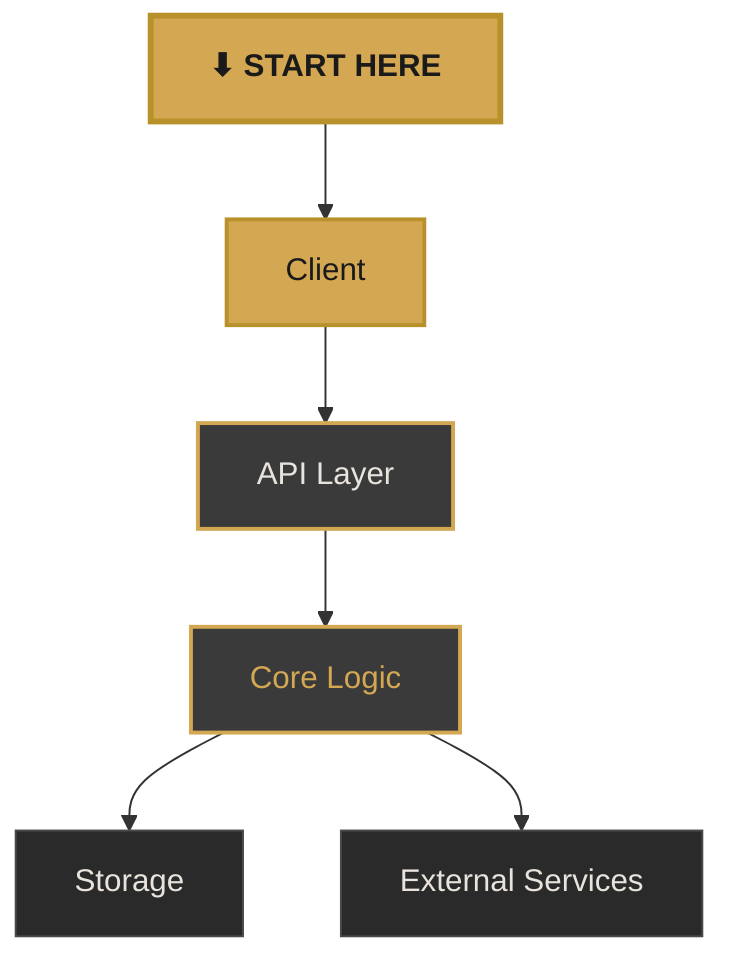

<!--
  ╔══════════════════════════════════════════════════════════════╗
  ║  BRAND TEMPLATE — Grey & Gold / Code Presentations         ║
  ║                                                            ║
  ║  Palette:                                                  ║
  ║    Background:  #1A1A1A (charcoal)                         ║
  ║    Text:        #E8E4DD (warm light)                       ║
  ║    Gold Accent: #D4A853 / #B8912A (darker)                 ║
  ║    Grey Mid:    #3A3A3A / #6B6B6B                          ║
  ║    Card BG:     #2A2A2A                                    ║
  ║    Code BG:     #1E1E1E (VS Code dark)                     ║
  ║    Subtle:      #4A4A4A (footer, page numbers)             ║
  ║                                                            ║
  ║  Typography:                                               ║
  ║    Headings:  Inter, system-ui (700 weight)                ║
  ║    Body:      Inter, system-ui (400 weight)                ║
  ║    Code:      JetBrains Mono, monospace                    ║
  ║                                                            ║
  ║  Footer (persistent on all slides):                        ║
  ║    Left:  "Mateo Segura · <Month> <Year>"                  ║
  ║    Right: "<codebase-name>-<version>"                      ║
  ║                                                            ║
  ║  Usage:                                                    ║
  ║    Copy this file, replace content, keep <style> blocks.   ║
  ║    Update --footer-left and --footer-right CSS vars.       ║
  ║    Never cut content — make slides bigger if needed.       ║
  ╚══════════════════════════════════════════════════════════════╝
-->

# Project Title

<div class="text-lg tracking-widest uppercase" style="color: #D4A853; margin-top: -0.5em;">
Subtitle or tagline
</div>

<div class="mt-6 text-base" style="color: #6B6B6B;">
One-line description of the project.
</div>

<!--
Cover slide speaker notes.
-->

<style>
h1 {
  color: #E8E4DD !important;
  font-weight: 700 !important;
  font-size: 3.2em !important;
  letter-spacing: -0.02em;
}
</style>

---
layout: default
---

# Overview

<div class="grid grid-cols-2 gap-8 mt-8">
<div>

### What It Does

A concise description of the project's purpose and primary value proposition.

- Key capability one
- Key capability two
- Key capability three

</div>
<div>

### Key Numbers

<div class="grid grid-cols-2 gap-4 mt-4">
  <div class="p-4 rounded-lg" style="background: #2A2A2A; border-left: 3px solid #D4A853;">
    <div class="text-3xl font-bold" style="color: #D4A853;">12K</div>
    <div class="text-xs uppercase tracking-wider" style="color: #6B6B6B;">Lines of Code</div>
  </div>
  <div class="p-4 rounded-lg" style="background: #2A2A2A; border-left: 3px solid #D4A853;">
    <div class="text-3xl font-bold" style="color: #D4A853;">94%</div>
    <div class="text-xs uppercase tracking-wider" style="color: #6B6B6B;">Test Coverage</div>
  </div>
  <div class="p-4 rounded-lg" style="background: #2A2A2A; border-left: 3px solid #D4A853;">
    <div class="text-3xl font-bold" style="color: #D4A853;">3</div>
    <div class="text-xs uppercase tracking-wider" style="color: #6B6B6B;">Dependencies</div>
  </div>
  <div class="p-4 rounded-lg" style="background: #2A2A2A; border-left: 3px solid #D4A853;">
    <div class="text-3xl font-bold" style="color: #D4A853;">v1.2</div>
    <div class="text-xs uppercase tracking-wider" style="color: #6B6B6B;">Latest Release</div>
  </div>
</div>

</div>
</div>

---

# Architecture



<div class="mt-6 flex gap-4 justify-center text-xs">
  <div class="flex items-center gap-2">
    <div class="w-4 h-4 rounded" style="background: #D4A853;"></div>
    <span style="color: #C8C4BD;">Entry point</span>
  </div>
  <div class="flex items-center gap-2">
    <div class="w-4 h-4 rounded border" style="background: #3A3A3A; border-color: #D4A853;"></div>
    <span style="color: #C8C4BD;">Core module</span>
  </div>
  <div class="flex items-center gap-2">
    <div class="w-4 h-4 rounded border" style="background: #2A2A2A; border-color: #4A4A4A;"></div>
    <span style="color: #C8C4BD;">Support / external</span>
  </div>
</div>

---
layout: two-cols
---

# Key Components

<div class="pr-4">

### Component A

Responsible for handling the primary business logic.

```go {2-3}
type Handler struct {
    store  Store
    logger *slog.Logger
}
```

<div class="mt-2 text-xs uppercase tracking-wider" style="color: #D4A853;">
Core · 450 LOC · 12 functions
</div>

</div>

::right::

<div class="pl-4" style="border-left: 1px solid #4A4A4A;">

### Component B

Manages data persistence and caching.

```go {2-3}
type Repository struct {
    db    *sql.DB
    cache *lru.Cache
}
```

<div class="mt-2 text-xs uppercase tracking-wider" style="color: #D4A853;">
Storage · 320 LOC · 8 functions
</div>

</div>

---

# Code Deep Dive

<div class="text-xs mb-4" style="color: #6B6B6B;">
Primary entry point and request handling flow
</div>

```go {lines:true,2,5-8}
func (h *Handler) ServeHTTP(w http.ResponseWriter, r *http.Request) {
    ctx := r.Context() // extract context

    // Parse and validate the incoming request
    req, err := decode(r)
    if err != nil {
        writeError(w, http.StatusBadRequest, err)
        return
    }

    // Execute core business logic
    result, err := h.process(ctx, req)
    if err != nil {
        writeError(w, http.StatusInternalServerError, err)
        return
    }

    writeJSON(w, http.StatusOK, result)
}
```

<div class="abs-br m-6">
  <span class="text-xs px-2 py-1 rounded" style="background: #D4A853; color: #1A1A1A; font-weight: 600;">
    HIGHLIGHTED: key logic paths
  </span>
</div>

---
layout: center
---

<div style="color: #D4A853; font-size: 1.2em; text-transform: uppercase; letter-spacing: 0.2em; margin-bottom: 1em;">
Section Break
</div>

# Section Title

<div class="text-lg" style="color: #6B6B6B;">
Section subtitle
</div>

---

# Metrics & Analysis

<div class="grid grid-cols-3 gap-6 mt-8">
  <div class="p-6 rounded-lg text-center" style="background: #2A2A2A; border-top: 3px solid #D4A853;">
    <div class="text-4xl font-bold" style="color: #D4A853;">8</div>
    <div class="text-sm mt-2" style="color: #E8E4DD;">Packages</div>
    <div class="text-xs mt-1" style="color: #6B6B6B;">Well-modularized</div>
  </div>
  <div class="p-6 rounded-lg text-center" style="background: #2A2A2A; border-top: 3px solid #D4A853;">
    <div class="text-4xl font-bold" style="color: #D4A853;">23</div>
    <div class="text-sm mt-2" style="color: #E8E4DD;">Exported Types</div>
    <div class="text-xs mt-1" style="color: #6B6B6B;">Clean API surface</div>
  </div>
  <div class="p-6 rounded-lg text-center" style="background: #2A2A2A; border-top: 3px solid #D4A853;">
    <div class="text-4xl font-bold" style="color: #D4A853;">0</div>
    <div class="text-sm mt-2" style="color: #E8E4DD;">Circular Deps</div>
    <div class="text-xs mt-1" style="color: #6B6B6B;">Clean dependency graph</div>
  </div>
</div>

---
layout: center
---

<div class="text-center">

# Thank You

<div class="text-lg mt-4" style="color: #6B6B6B;">
Questions, feedback, or contributions welcome.
</div>

<div class="mt-8 flex justify-center gap-8">
  <div class="text-sm">
    <div style="color: #D4A853;">Repository</div>
    <div class="font-mono" style="color: #E8E4DD;">github.com/org/project</div>
  </div>
</div>

<div class="mt-12 text-xs" style="color: #4A4A4A;">
Generated with Claude Code
</div>

</div>

<!-- GLOBAL STYLES — Applied to all slides -->
<style>
  :root {
    --slidev-theme-primary: #D4A853;
    --slidev-theme-accent: #B8912A;
    --footer-left: 'Mateo Segura · Jan 2026';
    --footer-right: 'project-v0.0.0';
  }

  .slidev-layout {
    background: #1A1A1A !important;
    color: #E8E4DD;
    font-family: 'Inter', system-ui, -apple-system, sans-serif;
  }

  /* Persistent footer — left */
  .slidev-layout::before {
    content: var(--footer-left);
    position: fixed;
    bottom: 1em;
    left: 2em;
    font-size: 0.65em;
    color: #4A4A4A;
    font-family: 'Inter', system-ui;
    letter-spacing: 0.02em;
    z-index: 100;
  }

  /* Persistent footer — right */
  .slidev-layout::after {
    content: var(--footer-right);
    position: fixed;
    bottom: 1em;
    right: 2em;
    font-size: 0.65em;
    color: #4A4A4A;
    font-family: 'JetBrains Mono', monospace;
    z-index: 100;
  }

  h1 {
    color: #E8E4DD !important;
    font-weight: 700 !important;
    letter-spacing: -0.02em;
    border-bottom: 2px solid #D4A853 !important;
    padding-bottom: 0.3em !important;
  }

  h2, h3 {
    color: #D4A853 !important;
    font-weight: 600 !important;
  }

  p, li {
    color: #C8C4BD;
    line-height: 1.7;
  }

  a {
    color: #D4A853 !important;
    text-decoration: none;
  }

  a:hover {
    color: #E8C678 !important;
  }

  code:not(pre code) {
    background: #2A2A2A !important;
    color: #D4A853 !important;
    padding: 0.15em 0.4em;
    border-radius: 4px;
    font-family: 'JetBrains Mono', 'Fira Code', monospace;
    font-size: 0.85em;
  }

  /* VS Code dark modern code blocks */
  pre {
    background: #1E1E1E !important;
    border: 1px solid #333333 !important;
    border-radius: 6px !important;
    font-family: 'JetBrains Mono', 'Fira Code', monospace !important;
    font-size: 0.82em !important;
    padding: 1.2em !important;
  }

  .shiki-container {
    background: #1E1E1E !important;
    border: 1px solid #333333 !important;
    border-radius: 6px !important;
  }

  table {
    border-collapse: collapse;
    width: 100%;
  }

  th {
    background: #2A2A2A !important;
    color: #D4A853 !important;
    font-weight: 600;
    text-transform: uppercase;
    font-size: 0.75em;
    letter-spacing: 0.08em;
    padding: 0.6em 1em;
    border-bottom: 2px solid #D4A853 !important;
  }

  td {
    padding: 0.5em 1em;
    border-bottom: 1px solid #3A3A3A !important;
    color: #C8C4BD;
  }

  tr:hover td {
    background: #2A2A2A;
  }

  blockquote {
    border-left: 3px solid #D4A853 !important;
    background: #2A2A2A !important;
    padding: 0.8em 1.2em;
    border-radius: 0 8px 8px 0;
    color: #C8C4BD;
  }

  .slidev-page-number {
    color: #4A4A4A !important;
  }

  .slidev-nav {
    background: #0D0D0D !important;
  }

  .mermaid {
    background: transparent !important;
  }
</style>
